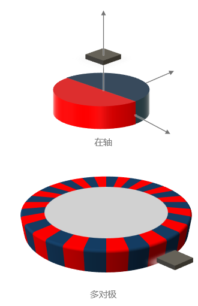
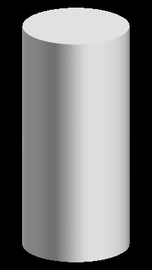

# KTM5800 - 超高精度磁编码器

## 产品概述

**KTM5800**是一款基于XMR（极磁阻）技术的超高精度磁编码器。它支持多极对30位角度细分，从而为精密角度测量应用提供卓越的性能。

### 核心特性

- **30位超高分辨率**：提供极高的角度测量精度。
- **XMR磁阻技术**：先进的磁感应技术。
- **多极对支持**：灵活的磁铁配置选项。
- **SPI通信接口**：标准数字接口。
- **低功耗设计**：适合电池供电应用。
- **工业级温度范围**：-40°C至+125°C工作温度。
- **高抗干扰能力**：优异的EMC性能。

### 典型应用

KTM5800适用于多种精密场景，包括：
- 精密角度测量系统
- 高精度编码器
- 机器人关节位置检测
- 精密仪器仪表
- 工业自动化控制
- 伺服电机反馈系统

---

## 技术文档下载

### PDF资料下载

以下是可用文档：
- [📋 KTM5800_EN.pdf](/pdfs/KTM5800_EN.pdf) - 英文数据手册
- [📋 KTM5800_支持多极对30bit角度细分器_1.5.pdf](/pdfs/KTM5800_支持多极对30bit角度细分器_1.5.pdf) - 中文技术手册

---

## 产品外观与封装

### 产品外观






### 应用电路原理图


---

## 引脚配置与功能

### 引脚定义

| 引脚名称 | 引脚序号 | 功能描述 | 电气特性 |
|----------|----------|----------|----------|
| VDD | 1 | 电源输入 | 3.0V - 5.5V |
| GND | 2 | 电源地 | 0V |
| SCK | 3 | SPI时钟输入 | 数字输入 |
| MISO | 4 | SPI数据输出 | 数字输出 |
| MOSI | 5 | SPI数据输入 | 数字输入 |
| CS | 6 | SPI片选输入 | 数字输入 |
| A | 7 | ABZ-A相输出 | 数字输出 |
| B | 8 | ABZ-B相输出 | 数字输出 |
| Z | 9 | ABZ-Z相输出 | 数字输出 |
| PWM | 10 | PWM模拟输出 | 模拟输出 |

### 功能框图

该编码器采用先进的XMR磁阻传感器阵列，通过检测旋转磁场的变化来确定角度位置。此外，内置的高精度ADC和数字信号处理器确保了输出的高精度和稳定性。

---

## 工作原理与算法详解

### XMR技术原理

KTM5800采用极磁阻（XMR）技术，这是一种基于磁阻效应的先进传感技术。具体而言，当外部磁场发生变化时，XMR传感器的电阻值会相应改变，从而通过测量这种电阻变化来精确确定磁场的方向和强度。

#### 磁阻效应公式

磁阻变化率可以用以下公式表示：

```
ΔR/R = (GMR × cos²θ) + (AMR × sin²θ)
```

其中：
- ΔR/R：电阻变化率
- GMR：巨磁阻效应系数
- AMR：各向异性磁阻效应系数
- θ：磁场与传感器轴的夹角

### 角度检测算法

#### 1. 多传感器阵列配置

KTM5800采用4个XMR传感器，按90°相位差排列：
- 传感器A：0°相位
- 传感器B：90°相位
- 传感器C：180°相位
- 传感器D：270°相位

#### 2. 信号处理算法

信号处理分为以下步骤：

**步骤1：原始信号采集**
```
VA = V0 + VA_amp × cos(θ + φA)
VB = V0 + VB_amp × cos(θ + φB)
VC = V0 + VC_amp × cos(θ + φC)
VD = V0 + VD_amp × cos(θ + φD)
```

**步骤2：差分信号计算**
```
Vsin = (VA - VC) / 2
Vcos = (VB - VD) / 2
```

**步骤3：CORDIC算法角度计算**

CORDIC（坐标旋转数字计算机）算法用于计算反正切值：

```
θ = arctan(Vsin / Vcos)
```

CORDIC迭代公式：
```
X(i+1) = X(i) - d(i) × Y(i) × 2^(-i)
Y(i+1) = Y(i) + d(i) × X(i) × 2^(-i)
Z(i+1) = Z(i) - d(i) × arctan(2^(-i))
```

其中d(i) = +1 if Y(i) < 0, else -1

#### 3. 误差补偿算法

误差补偿包括：

**温度补偿**
```
θ_compensated = θ_raw + K_temp × (T - T_ref)
```

**非线性补偿**
```
θ_final = θ_compensated + Σ(An × sin(n × θ_compensated))
```

### 多极对处理算法

对于多极对磁铁，角度计算需要考虑极对数。具体公式为：

```
θ_mechanical = θ_electrical / pole_pairs
```

其中：
- θ_mechanical：机械角度
- θ_electrical：电气角度
- pole_pairs：极对数

---

## 技术规格与参数详解

### 电气特性

| 参数 | 最小值 | 典型值 | 最大值 | 单位 | 条件 | 计算公式 |
|------|--------|--------|--------|----- |------|----------|
| 工作电压 | 3.0 | 3.3/5.0 | 5.5 | V | - | - |
| 工作电流 | - | 15 | 25 | mA | VDD=5V | I = P_total/VDD |
| 待机电流 | - | 1 | 5 | µA | 低功耗模式 | - |
| 工作温度 | -40 | 25 | +125 | °C | - | - |
| 存储温度 | -55 | - | +150 | °C | - | - |

### 磁场特性与计算

| 参数 | 最小值 | 典型值 | 最大值 | 单位 | 备注 | 计算方法 |
|------|--------|--------|--------|----- |------|----------|
| 磁场强度 | 30 | 50 | 100 | mT | 推荐工作范围 | B = μ₀ × M / (4π × r³) |
| 磁铁直径 | 4 | 6 | 10 | mm | 圆形磁铁 | - |
| 气隙距离 | 0.5 | 1.0 | 2.0 | mm | 传感器到磁铁 | - |
| 极对数 | 1 | 1 | 8 | - | 可配置 | - |

#### 磁场强度计算公式

对于圆形磁铁，轴向磁场强度：

```
Bz = (μ₀ × M × R²) / (2 × (R² + z²)^(3/2))
```

其中：
- Bz：轴向磁场强度
- μ₀：真空磁导率 (4π × 10⁻⁷ H/m)
- M：磁化强度
- R：磁铁半径
- z：气隙距离

### 精度特性与误差分析

| 参数 | 典型值 | 最大值 | 单位 | 条件 | 误差来源 |
|------|--------|--------|----- |------|----------|
| 角度分辨率 | 30 | - | bit | - | ADC量化误差 |
| 绝对精度 | ±0.1 | ±0.2 | ° | 25°C | 系统误差 |
| 重复精度 | ±0.05 | ±0.1 | ° | - | 随机噪声 |
| 线性度 | ±0.1 | ±0.2 | %FS | - | 传感器非线性 |
| 温度漂移 | ±50 | ±100 | ppm/°C | -40°C~+125°C | 温度系数 |

#### 精度计算公式

**角度分辨率**
```
Resolution = 360° / 2^n
```
其中n为ADC位数（30位）

**总误差计算**
```
Total_Error = √(Linearity² + Repeatability² + Temperature_Drift²)
```

---

## 校准算法与参数

### 自动校准流程

1. **零点校准**
   - 记录初始位置作为零点参考
   - 计算零点偏移：`Offset = θ_measured - θ_reference`

2. **增益校准**
   - 旋转一圈测量多个点
   - 计算增益系数：`Gain = 360° / (θ_max - θ_min)`

3. **非线性校准**
   - 使用查找表或多项式拟合
   - 补偿公式：`θ_corrected = a₀ + a₁θ + a₂θ² + ... + aₙθⁿ`

### 校准参数存储

校准参数存储在内部EEPROM中：
- 零点偏移：16位
- 增益系数：16位
- 非线性系数：8×16位
- 温度系数：4×16位

---

## SPI通信协议详解

### 数据格式

**16位模式**
```
[15:14] - 状态位
[13:0]  - 角度数据 (14位)
```

**32位模式**
```
[31:30] - 状态位
[29:0]  - 角度数据 (30位)
```

### 通信时序

1. **读取命令**
   - CS下降沿启动传输
   - 发送读取命令（0x8000）
   - 接收角度数据
   - CS上升沿结束传输

2. **写入命令**
   - CS下降沿启动传输
   - 发送写入命令和数据
   - 等待确认
   - CS上升沿结束传输

### 寄存器映射

| 地址 | 寄存器名称 | 功能描述 | 默认值 |
|------|------------|----------|--------|
| 0x00 | ANGLE_H | 角度高位 | 0x0000 |
| 0x01 | ANGLE_L | 角度低位 | 0x0000 |
| 0x02 | STATUS | 状态寄存器 | 0x0000 |
| 0x03 | CONFIG | 配置寄存器 | 0x0001 |
| 0x04 | OFFSET_H | 偏移高位 | 0x0000 |
| 0x05 | OFFSET_L | 偏移低位 | 0x0000 |

---

## 封装信息

### 封装类型

- **封装形式**：QFN-16 (3mm × 3mm)
- **引脚间距**：0.5mm
- **封装厚度**：0.75mm
- **焊盘尺寸**：详见封装图纸

### 推荐PCB设计

1. **电源去耦合**：在VDD引脚附近放置100nF陶瓷电容
2. **地平面**：使用完整的地平面设计
3. **信号走线**：数字信号线远离模拟信号线
4. **热设计**：确保良好的散热路径

---

## 应用指南

### 磁铁选择与安装

1. **磁铁类型**：推荐使用钕铁硼永磁体
2. **磁化方向**：径向磁化或轴向磁化
3. **安装位置**：磁铁中心与传感器中心对齐
4. **气隙控制**：保持1mm±0.5mm的气隙距离

### 系统集成

1. **SPI通信**：支持模式0和模式3
2. **数据格式**：16位或32位角度数据
3. **更新频率**：最高1MHz SPI时钟
4. **校准程序**：支持一键自动校准

---

## 设计注意事项

### 电源设计

- 使用低噪声线性稳压器
- 添加适当的滤波电容
- 避免电源纹波过大

### PCB布局设计

- 传感器下方避免铜箔填充
- 保持良好的热设计
- 数字和模拟信号分离

### EMC设计

- 添加适当的EMI滤波
- 使用屏蔽措施
- 注意接地设计

---

## 相关产品推荐

### 同系列产品

- [KTM5900](/pdfs/KTM5900_24bit绝对角度磁性编码器_1.6.pdf) - 24位绝对角度磁性编码器
- [KTM5910](/pdfs/KTM5910_24bit绝对角度磁性编码器_1.6.pdf) - 24位绝对角度磁性编码器（增强版）

### 其他推荐产品

- [KTH7801](../../magnetic-encoder/KTH7801.md) - 高精度磁编码器
- [KTH7812](../../magnetic-encoder/KTH7812.md) - 工业级磁编码器

---

## 技术支持

如需技术支持或产品咨询，请联系：

- **技术支持邮箱**：support@conntek.com.cn
- **销售咨询电话**：+86(0)755-86006609
- **官方网站**：[https://www.conntek.com.cn](https://www.conntek.com.cn)
- **技术文档**：[技术资料下载](../../technical/)

---

## 原始PDF内容摘要

{md_content}

---

*文档版本：v3.0 - 基于PDF重新撰写版，包含详细算法解释*  
*最后更新：2024年12月*
